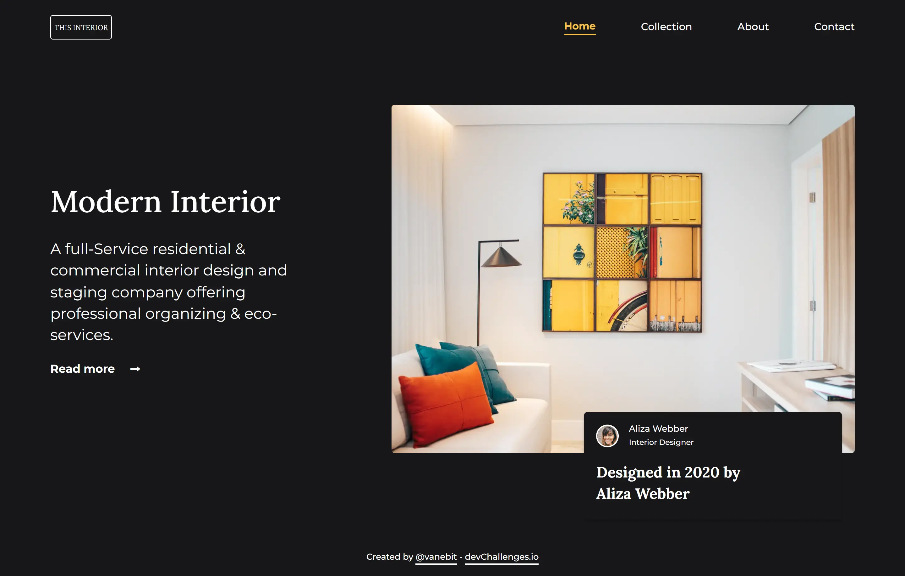

<!-- 10 October 2022 -->

<h1 align="center">Interior Consultant</h1>

   Solution for a challenge from  <a href="http://devchallenges.io" target="_blank">Devchallenges.io</a>.

  <h3>
    <a href="https://vanebit.github.io/interior-consultant/">
      Demo
    </a>
     | 
    <a href="https://github.com/vanebit/interior-consultant">
      Solution
    </a>
     | 
    <a href="https://devchallenges.io/challenges/Jymh2b2FyebRTUljkNcb">
      Challenge
    </a>
  </h3>

## Table of contents

📌 [The challenge](#the-challenge)

📌 [Screenshot](#screenshot)

📌 [Link](#link)

📌 [Built with](#built-with)

📌 [Useful resources](#useful-resources)

📌 [Author](#author)

## **The challenge**

Users should be able to:

✅ View the optimal layout depending on their device's screen size

✅ See hover states for interactive elements

## **Screenshot**

🧿 Mobile

🧿 Desktop

## **Link**

🔗 [DevChallenges solution here](https://devchallenges.io/solutions/KsOaGFuKBgbrRxA6Y5Ej) 👀

## **Built with**

✨ Mobile-first workflow

✨ Semantic HTML markup

✨ Custom properties

✨ Utility classes

✨ Grid

✨ Flexbox

✨ Pseudo-element and Pseudo-classes

## **Useful resources**

🎉 [Markup Validation](https://validator.w3.org/#validate_by_input) - Markup Validation Service

🎉 [CSS Specificity](https://jonassebastianohlsson.com/specificity-graph/) - CSS Specificity Graph Generator

🎉 [Flaticon](https://www.flaticon.com/free-icons/art-and-design) - Icons created by Freepik

## **Author**

✨ DevChallenges - [@vanebit](https://devchallenges.io/portfolio/vanebit)

✨ Frontend Mentor - [@vanebit](https://www.frontendmentor.io/profile/vanebit)

✨ CodePen - [@vanebit](https://codepen.io/vanebit)

✨ Twitter - [@vanebit_](https://twitter.com/vanebit_)